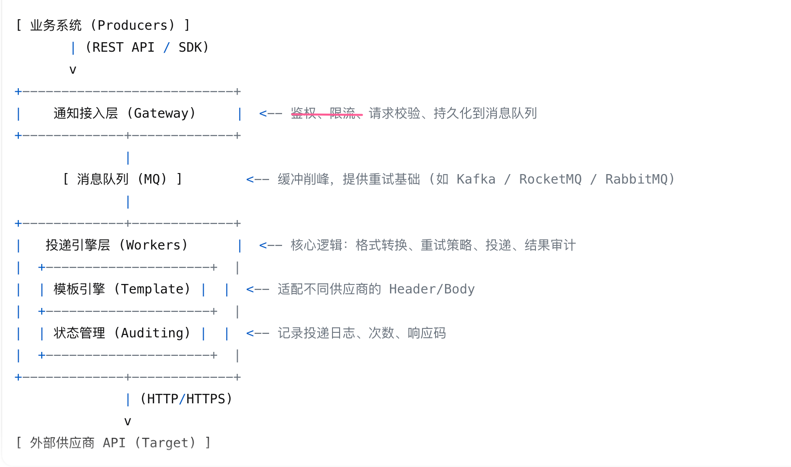
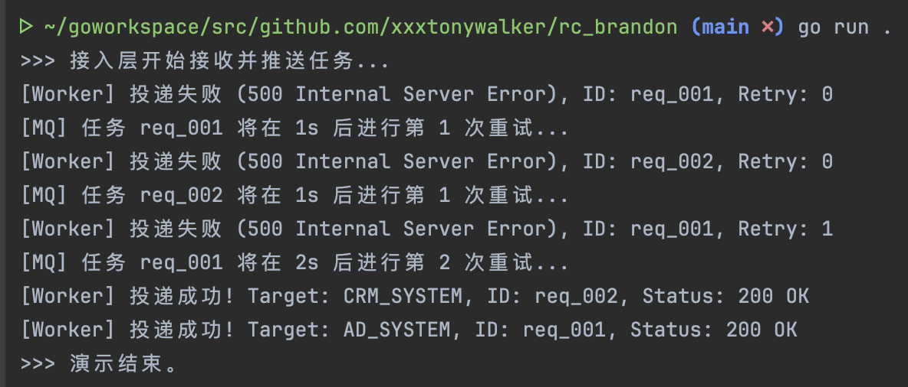
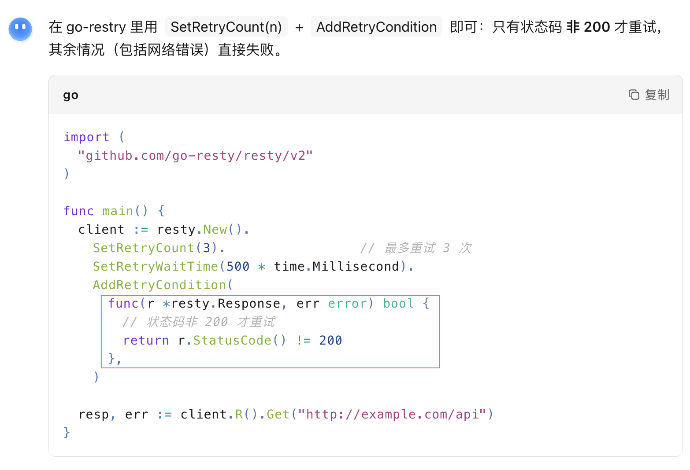
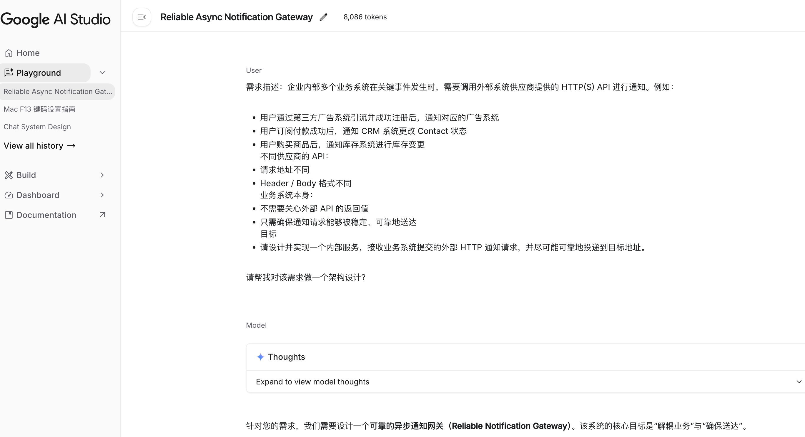
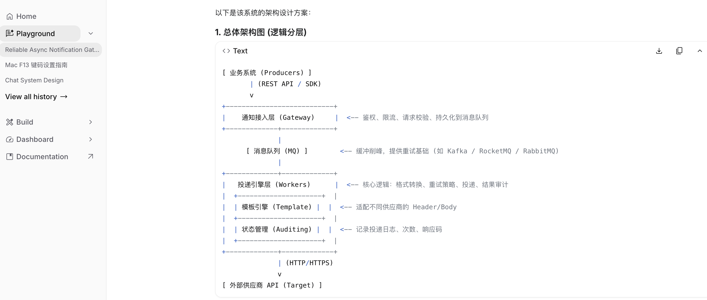
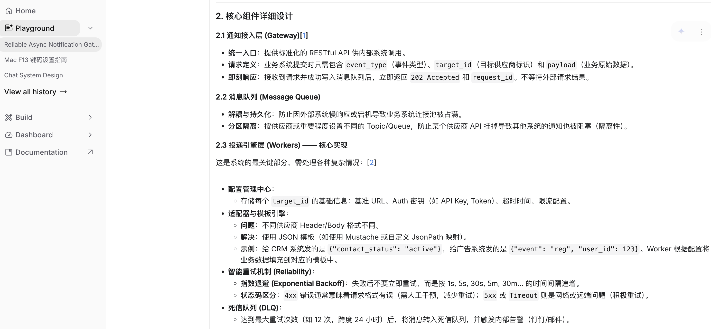
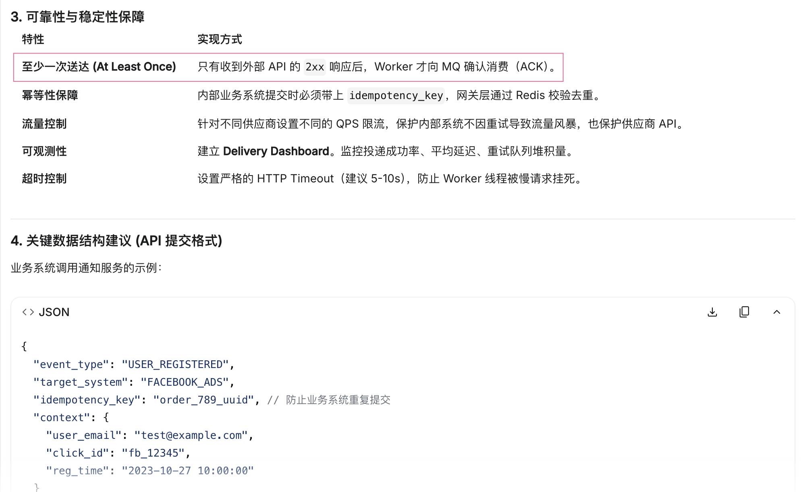
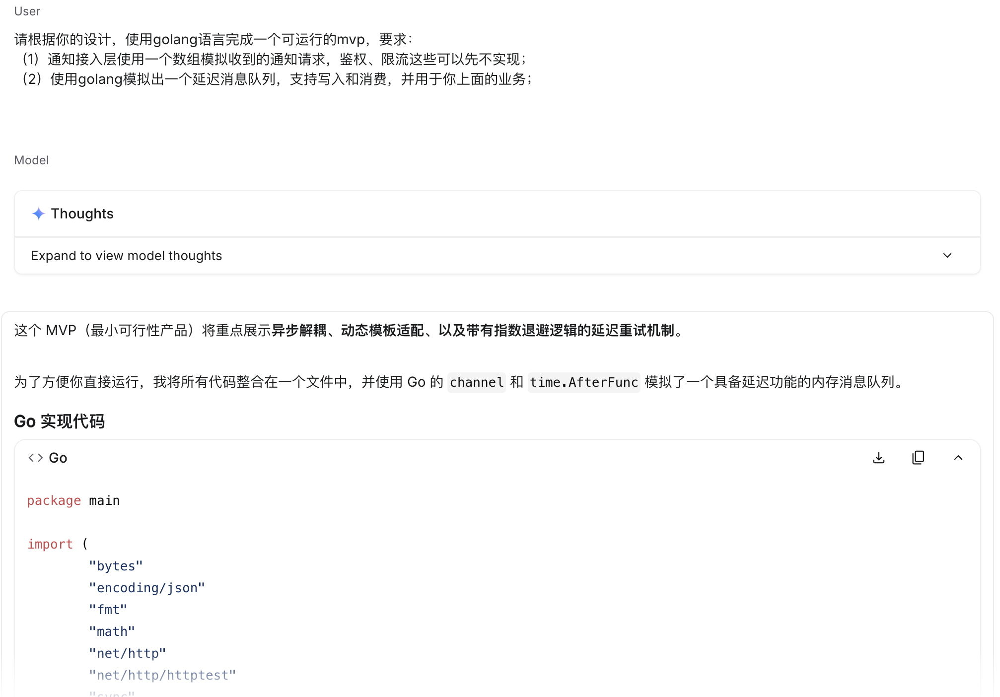

# rc_brandon

## 问题理解

设计一个可靠的消息投递模块，但是不能根据业务方返回的业务 code 来确定是否成功，所以该业务本质上只需保证消息投递成功，下游顺利接收，至于下游是否处理成功，本模块不做保证。  
在这种 http 通知模式下，就只能通过 http 状态码来确定：200 表示成功，非 200 表示失败，需要再次投递。另外还可能存在没有任何状态码情况，这种情况也认为失败，需再次投递。

## 核心设计

### 架构图

整体思路为借助延迟队列来达到失败反复投递的目的  

### 系统边界

### 可靠性与失败处理

至少一次  
外部系统长期不可用时，该条投递进入失败队列并报警，人工处理

### 取舍与演进

过度设计: 通知接入层的鉴权限流  
业务初期无需这么完备，会拖慢上下游协同速度，待业务起来后再加。

未来演进思路:  
针对流量大的场景，为消息比较大的租户创建单独消息队列topic，消费端增加消费线程单独处理。  
针对复杂度明显上升的问题，可以增加上述设计图中层次，尽量保证每一层功能相关性高且简单，这样的话复杂的问题就被拆解成了一个个的小问题。  
另外还可以将一些功能配置化，比如一条消息的最大投递次数、投递下游的地址（如果下游的地址固定，就不需要每条消息中都带上投递地址）和过滤规则（上游可能希望过滤调某些消息不要投放）等，这样能让整个模块更通用，更少开发任务。

## 代码实现

见 main.go  
运行方法: go run .
运行效果:  

## 引入的中间件

引入了延迟消息队列，引入它的原因是其语义天生适合这种业务场景，消息队列一般都是分布式部署，其可靠性和性能都比较高。  
如果不引入它，也可以使用 MySQL 来代替，用一张通知失败表来记录通知失败的任务，同时也记录失败次数。  
用一个额外的任务来定时扫描这张失败表中数据并进行重试，成功则从该表中移出，失败则增加失败次数，等待下次扫描，到达失败次数上限则移到另外一张死信表并报警。

## AI 使用说明

### AI提供的关键帮助

AI 的设计思路和我想到的基本一致，借助延时队列来重试，http 状态码来确定是否投递成功。  
但是 AI 的那种分层设计思维是我没能想到的，我想到的是流水线式的处理流程和实现。
分层虽然增加了一点代码实现的复杂性，但整体看起来更清晰，后续可维护性和扩展性也都更好，每一层功能单一，如果需要增加其它的功能，增加新的层次即可。修改其中的某一层，也不会影响到其它层次的功能。

### AI给出的未采纳的建议

通知接入层的鉴权、限流：如果本模块的上游都是公司内部系统，初期可以不必这么完备，这些功能的引入会增加系统的复杂性，拖慢上下游协作的进度。等到业务达到一定程度，再去改造也来得及；

### 自己做出的关键决策

AI 的设计中有一项「消费消息时，外部API返回 `2xx` 才向MQ确认」，我不认为该这样设计，而应该采用非确认的消费方式。  
因为消息队列在 ACK 消费模式下，不 ACK，消费的 offset 就不会被提交，下次消费仍然会从上次的位置继续消费。任意一条持续失败的消息都会导致整个消息队列堆积大量未处理消息。
我认为应该在通知下游时直接重试，重试多次仍不成功，就持久化到消息队列，等着下一次通知，这样也能保证「至少一次」的语义。现代的 http sdk 一般都支持设置非 200 自动重试：  

### AI使用记录

